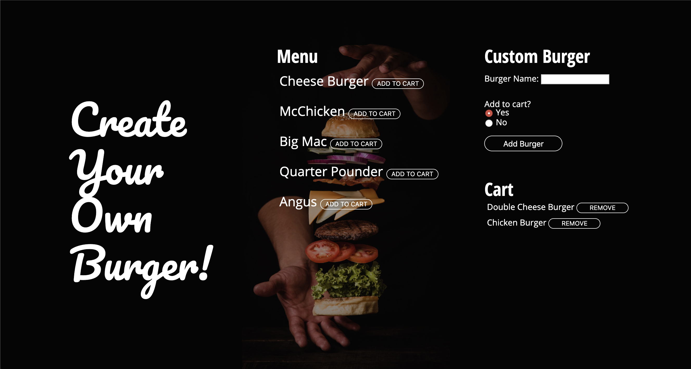

# Custom Burgers
## Launch App
https://polar-fjord-25577.herokuapp.com/

## Overview
A burger logger made with MySQL, Node, Express, Handlebars and a homemade ORM. Follows the MVC design pattern; Node and MySQL to query and route data in the app, and Handlebars to generate the HTML.

## Technologies Used
* Node.js
* Express
* Custom ORM
* MySql
* Handlebars
* Fully Responsive Design

## Home Page

